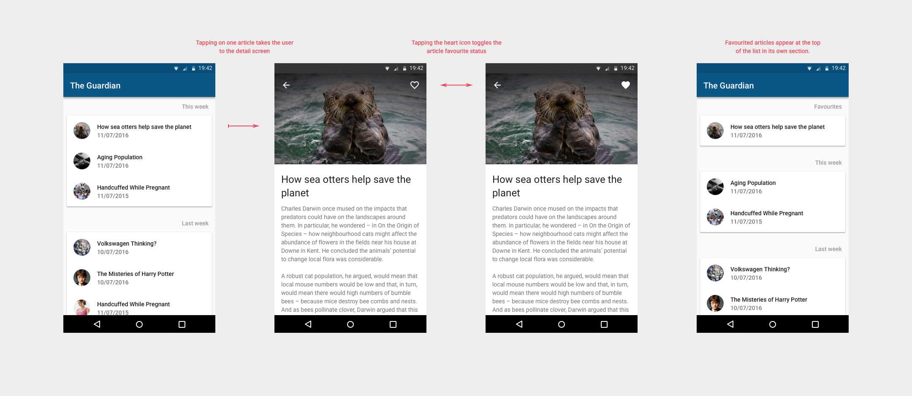

# Monzo Code Test for Android Engineers

## Instructions

A developer at your company has been working on an app. The app uses the Guardian's news API to fetch headlines and display them to the user. Users can favourite articles that they like.

You've inherited their unfinished project, and a [design mockup](The_Guardian.sketch). It looks like the project might have some bugs, and the user interface definitely needs some work.

Your job is to add the missing features shown in the enclosed specification, fixing any bugs you might come across and prioritising as you see fit. Feel free to re-work any aspect of the codebase you're not happy with: you own this project now.

You should spend no more than 4 hours on the project - we know this isn't anywhere near enough time to complete the spec, so no pressure to build all the features or fix all the bugs! We're interested to see how far you get in that time and the decisions you make along the way. Please include a short note with your response, explaining:

- what were your priorities, and why?
- if you had another two days, what would you have tackled next?
- what would you change about the structure of the code?
- what bugs did you find but not fix?
- what would you change about the visual design of the app?

Make a zip of your solution and upload it to the link in the email inviting you to this repository. Let us know roughly how long you spent on the exercise - as we're a product company, we're looking for people with a strong product and design focus, as well as being good engineers.

We know it's tough to find a spare half day, so there's no hard deadline - if you're busy or travelling right now and won't find time in the next week or so, please let us know so we don't check-in with you too early!
